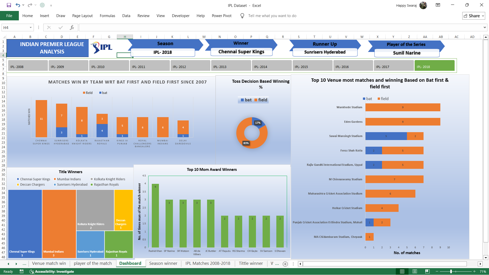

# 🏏 IPL Data Analysis (2008–2018)

An interactive **Excel dashboard** that analyzes 10 seasons of Indian Premier League (IPL) match data using **Pivot Tables, Pivot Charts, and Slicers** — turning 696 raw match records into a single-page, click-to-filter analytics dashboard.



---

## 📌 Overview

This project explores IPL match data from **2008 to 2018** to uncover patterns around toss decisions, venues, player performances, and season-wise title winners. All analysis is done natively in Excel — no external BI tool required — making it a lightweight, shareable, and fully interactive workbook.

---

## 📂 Dataset

**File:** `IPL Dataset.xlsx`

The raw data (`IPL Matches 2008-2018` sheet) contains **696 matches** with the following fields:

| Column | Description |
|---|---|
| `id` | Unique match ID |
| `city` | City where the match was played |
| `Season` | IPL season (e.g., IPL-2018) |
| `date` | Match date |
| `player_of_match` | Player awarded Man of the Match |
| `venue` | Stadium name |
| `team1`, `team2` | Teams that played |
| `toss_winner` | Team that won the toss |
| `toss_decision` | Bat or Field |
| `result` | Match result type (normal, tie, no result) |
| `winner` | Match winner |
| `win_by_runs` | Margin of victory (runs) |
| `win_by_wickets` | Margin of victory (wickets) |
| `umpire1`, `umpire2` | On-field umpires |

---

## 📊 Dashboard & Analysis Sheets

The workbook is organized into a main **Dashboard** tab, backed by pivot tables built on separate sheets:

| Sheet | What it shows |
|---|---|
| **Dashboard** | Consolidated view combining all charts and slicers for interactive filtering |
| **Matches Win by Toss** | Whether winning the toss (bat/field) translates to winning the match, by team |
| **Toss Decision** | Overall split of teams choosing to bat vs. field first after winning the toss |
| **Venue Match Win** | Win counts by stadium/venue |
| **Player of the Match** | Most frequent Player of the Match award winners |
| **Season Winner** | Champion, runner-up, Player of the Match, and Player of the Series for each season |
| **Title Winner** | Total IPL titles won per team (2008–2018) |
| **Winner Data** | Season-by-season summary table (source for the Season Winner pivot) |

**Interactive elements:**
- 🔘 **Slicers** to filter by team and season across all linked charts at once
- 📈 **Pivot Charts** (bar/column charts) for toss trends, venue performance, and title counts
- 🔄 Fully **drill-down / cross-filterable** — clicking a slicer updates every connected visual

---

## 🔍 Key Insights

- **Mumbai Indians** and **Chennai Super Kings** lead the title count with **3 championships** each over the analyzed period.
- Teams disproportionately chose to **field first** after winning the toss, suggesting a chasing-friendly trend across most seasons.
- Certain venues show a strong home-advantage pattern in win counts.
- A small set of players (e.g., top all-rounders) account for a disproportionate share of Player of the Match awards.

---

## 🛠️ Tools Used

- **Microsoft Excel** — Pivot Tables, Pivot Charts, Slicers, Dashboard design

---

## 🚀 How to Use

1. Download / clone this repository.
2. Open `IPL Dataset.xlsx` in Microsoft Excel (Excel 2016+ recommended for full Slicer support).
3. Go to the **Dashboard** tab.
4. Use the **Season** and **Team** slicers to filter the entire dashboard interactively.
5. Explore individual pivot sheets for the underlying tables behind each chart.

```bash
git clone https://github.com/dev-happy02/IPL_data_analysis-.git
```

---

## 👤 Author

**Happy Swaraj**
🔗 [GitHub](https://github.com/dev-happy02)

---

⭐ If you find this useful, consider giving the repo a star!
